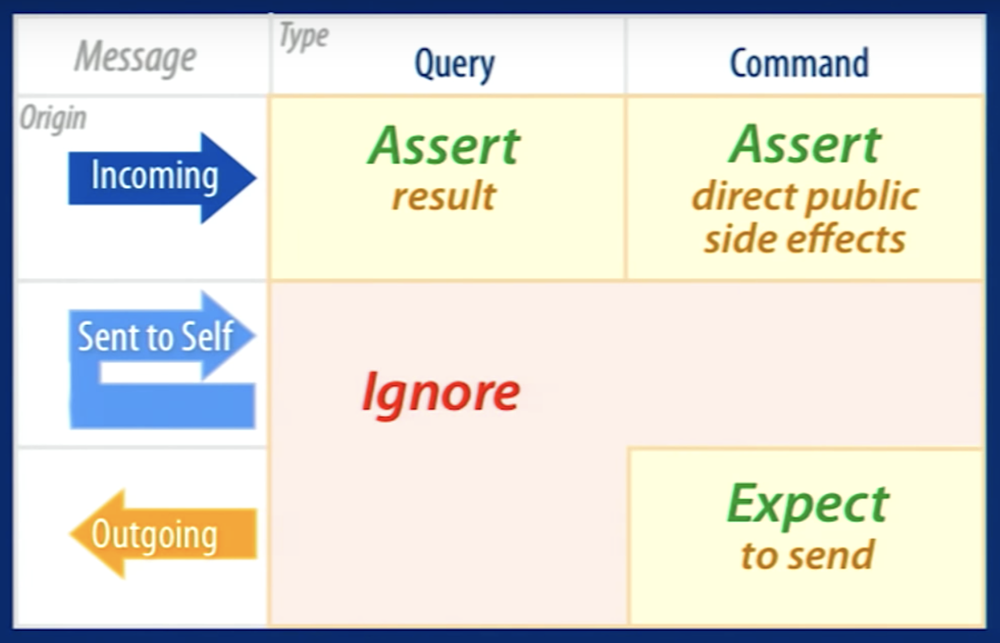

# Todo App

แอพนี้ทำมาสำหรับอธิบายเรื่องการเขียนเทสใน Vue.js แบบง่ายๆ นะครับ

---

### Other resource

[อันนี้](https://lmiller1990.github.io/vue-testing-handbook/simulating-user-input.html#writing-the-test) เป็น guideline ที่ดีมาก ในการเร่ิมต้นเขียน test

[อันนี้](https://www.youtube.com/watch?v=URSWYvyc42M&t=948s) เป็น Talk ที่ดีมาก เกี่ยวกับการเขียน Unit test โดยรวม ถ้ามีคำถามว่า เวลาเขียนเทส ควรจะเทสอะไรบ้าง แนะนำให้ไปดู Talk นี้

